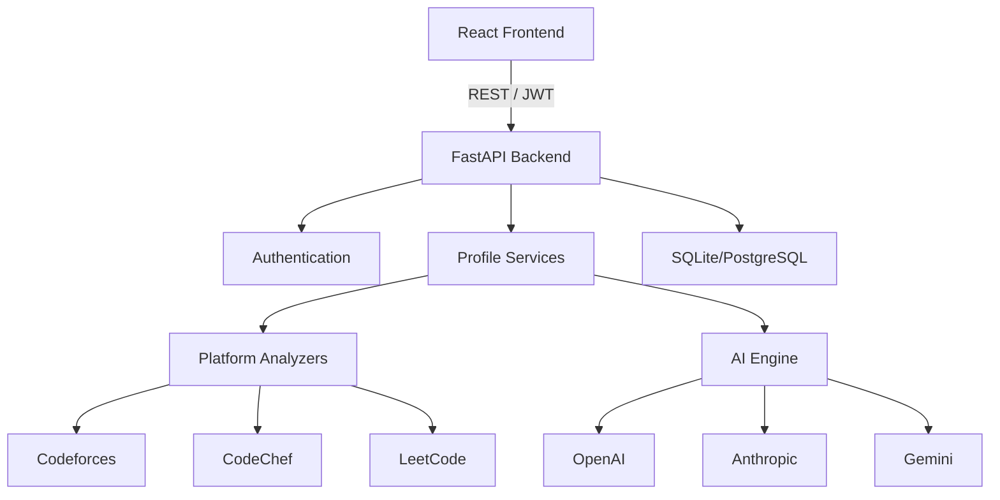

<div align="center">
  
  
  <h1>Interview Prep AI</h1>
  
  <p><b>AI-powered interview preparation platform that transforms competitive programming profiles into personalized analytics, company readiness insights, and GenAI-powered interview coaching.</b></p>

  <p>
    <a href="#"></a>
    <a href="#"></a>
    
    
    
    
    
  </p>
</div>

---

## 🌐 Live Demo

* **Frontend (Vercel):** [https://interview-prep-ai-five-mauve.vercel.app](https://interview-prep-ai-five-mauve.vercel.app)
* **Backend API (Render):** [https://interview-prep-ai-api-q8vh.onrender.com](https://interview-prep-ai-api-q8vh.onrender.com)
* **Swagger API Docs:** [https://interview-prep-ai-api-q8vh.onrender.com/docs](https://interview-prep-ai-api-q8vh.onrender.com/docs)

---

## 📖 Overview

**Problem:** Competitive programming platforms generate massive amounts of data (submissions, rating deltas, topics) but fail to translate that data into actionable insights for corporate hiring bars (FAANG, tier-2, startups).

**Solution:** Interview Prep AI bridges the gap between competitive programming and real-world software engineering interviews. 

**Key Idea:** It aggregates raw CP data across platforms, runs deterministic heuristic analytics to find weaknesses, and passes the distilled context to Large Language Models (LLMs) to generate personalized study plans, interview preparation feedback, and interactive coaching.

**Who is this for?** Competitive programmers, CS students, and SWE candidates looking to optimize their interview preparation using their existing coding history.

---

## ✨ Features

### 📊 Analytics
- **Multi-platform Analytics:** Full support for Codeforces, LeetCode, and CodeChef.
- **Platform Synchronization:** Synchronize and merge profiles across platforms into a unified dashboard.
- **Company Readiness:** Deterministic intelligence engine evaluating readiness for specific companies.
- **Topic Intelligence:** Identifies knowledge gaps (Weak Topics) and proficiencies (Strong Topics).
- **Interactive Analytics Dashboard:** Visualize data using Recharts radar and bar graphs.

### 🤖 AI Features
- **AI Interview Coach:** Real-time interactive coach for algorithm deep-dives and mock interviews.
- **AI Replay:** Context-aware replays analyzing performance and past contest behaviors.
- **Personalized Recommendations:** Rule-based actionable advice based on activity and trends.
- **Multiple AI Providers:** Seamlessly routes between OpenAI, Anthropic, and Gemini for the best models based on context.

### 🔐 Authentication
- **JWT Login:** Secure JSON Web Tokens stored and managed via React Context.
- **Refresh Tokens:** Long-lived session management allowing persistent logins.
- **Protected APIs:** FastAPI route protection via dependency injection and `OAuth2PasswordBearer`.
- **User Profiles:** Automatically tracks users and generated reports in the database.

---

## 🚀 Deployment

This project is deployed to a modern, decoupled cloud architecture using automatic CI/CD from the `main` branch.

- **Frontend (Vercel):** Deployed as a static SPA. It uses `VITE_API_BASE` injected at build-time to communicate with the Render API.
- **Backend (Render):** Deployed as a Dockerized FastAPI application. It automatically builds from the provided `Dockerfile` and initializes the database tables dynamically via FastAPI's `@asynccontextmanager` lifespan event.

### Environment Variables
- `VITE_API_BASE` (Frontend): The base URL pointing to the Render backend.
- `DATABASE_URL` (Backend): Connection string for the persistent Postgres/SQLite database.
- `SECRET_KEY` (Backend): 256-bit secure key for JWT encoding.
- `OPENAI_API_KEY`, `ANTHROPIC_API_KEY`, `GEMINI_API_KEY` (Backend): API keys for generative AI routing.

---

## 🏗 Project Architecture

The platform uses a layered, decoupled architecture ensuring the UI, business logic, and database remain strictly independent.



---

## 💻 Tech Stack

- **Frontend:** React 18, Vite, TypeScript, Tailwind CSS, Framer Motion, Recharts
- **Backend:** Python 3.12, FastAPI, Uvicorn, Pydantic
- **Database:** SQLite (local) / PostgreSQL (production), SQLAlchemy ORM, Alembic Migrations
- **Authentication:** JWT, passlib, bcrypt
- **AI / LLMs:** OpenAI, Anthropic, Google Generative AI
- **Deployment:** Docker, Vercel (Frontend), Render (Backend)

---

## 📡 API Endpoints

| Method | Endpoint | Description |
| :--- | :--- | :--- |
| `POST` | `/auth/register` | Creates a new user account and returns a JWT |
| `POST` | `/auth/login` | Authenticates a user and returns a JWT |
| `GET` | `/auth/me` | Retrieves the currently authenticated user's details |
| `GET` | `/report?url={url}` | Triggers the complete report generation pipeline |
| `POST` | `/coach/chat` | Interacts with the AI Coach using the current report context |
| `GET` | `/platforms/analysis` | Compares and analyzes connected platform profiles |
| `GET` | `/settings/providers` | Retrieves configured LLM providers for the user |
| `POST` | `/settings/providers` | Updates LLM provider API keys or configurations |

---

## 📸 Screenshots

| Dashboard | AI Coach |
| :---: | :---: |
|  |  |

| Multi-Platform Sync | Company Readiness |
| :---: | :---: |
|  |  |

---

## 🚀 Installation & Setup

### 1. Database Setup
The backend defaults to a local SQLite database (`app.db`), so no explicit PostgreSQL setup is required for local development.

### 2. Backend Setup

```bash
# Clone the repository
git clone https://github.com/Tan-ish-ka/interview-prep-ai.git
cd interview-prep-ai

# Create and activate virtual environment
python3.12 -m venv .venv
source .venv/bin/activate  # On Windows: .venv\Scripts\activate

# Install dependencies
pip install -r requirements.txt

# Environment Variables
cp .env.example .env
# Edit .env with your Secret Key and API Keys
# SECRET_KEY=your_secure_random_string
# OPENAI_API_KEY=sk-...

# Start the FastAPI server (auto-initializes database)
export PYTHONPATH=src
uvicorn interview_prep_ai.app.main:app --reload --port 8000
```

### 3. Frontend Setup

```bash
cd frontend

# Install dependencies
npm install

# Start the Vite development server
npm run dev
```

---

## 👥 Contributors

- **Tan-ish-ka** - *Full Stack Developer* - [GitHub Profile](https://github.com/Tan-ish-ka)

---

## 📄 License

This project is licensed under the MIT License - see the [LICENSE](LICENSE) file for details.
